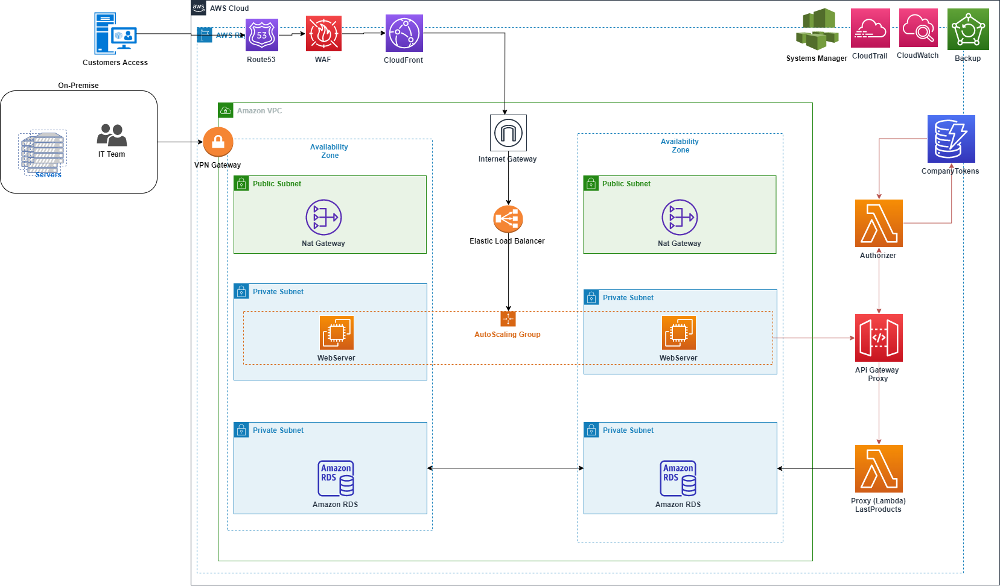

# SoapToServerlessAPI

SOAP Service in NodeJS communicating with API Gateway which transforms the information using VTL to Lambda. Lambda reply back to API Gateway to maintain backward to SOAP and in JSON to REST calls.
The communication from the API Gateway is secured by a Lambda Authorizer using a Header injection.
The token to be sent to Lambda Authorizer is created internally by Secret Manager. It is only accessible by account owner. 

## Notes for the Author

This project has been created using NodeJS. The reason is not .Net or Java created some dependency in Specific IDEs like VS2019 for .NET. For learning perspective, NodeJS is available to be executed locally without IDE at all. The SOAP WS is using SOAP NPM library of NodeJS and it is not expected this solution would be found in real world but it has been created for learning purposes.

## High level Architecture
This example shows a possible use case of this scenario. A company has a legacy application communicating between layers using SOAP Services. The team that is in charge of the business logic wants to start migrating part of the code to Serverless but have backward compatibility with the front-end layer. So communication between the front-end and backend has to remain in SOAP contract but with business logic in serverless solution. This example show how to do that.



## Technical requirements

1. VSCode or any other compatible NodeJS IDE
2. Git tool to download the project
3. NodeJS installed https://nodejs.org/en/
4. To debug locally you need Docker desktop https://www.docker.com/products/docker-desktop/
5. Configure VSCode to run locally SAM https://docs.aws.amazon.com/toolkit-for-vscode/latest/userguide/serverless-apps.html
6. For the EC2 instance a KeyPair is needed. It must be created before the CloudFormation Deployment to be done. Please save the private key in a place that you can access afterwards. SSH is going to be needed.

## Getting started

Download the project in your local machine using a Git client.

## Install NPM dependencies of the project

Open a terminal Windows, Linux or Mac

1. Install dependencies for the SOAPWS
   1.a) Go to SimulatedLegacyApp\SOAPWS --> run > npm install
2. Install dependencies for the NodeJSLambda
   2.a) Go to NodeJSLambda\Lambdacode --> run > nmp install
3. Install dependencies for the LambdaAuthorizer
   3.a) Go to NodeJSLambda\LambdaAuthorizer --> run > nmp install

## Run the solution locally

Please review the README.md of every project to get more information
To test the end to end solution with Postman I have included postmancollections-SOAPCall.json and Postmancollection-APIcall.json (please update it on demand) in the root of each project. It can be added in Postman https://www.postman.com/ for testing purposes.

## Backend SOAP legacy system

The cloudformation inside of the SimulatedLegacyApp folder (template.yaml) creates a EC2 instance in a VPC with public IP Address. There is a Security Group with ports 8080 and 22 opened by a Security Group. The idea is to simulate a legacy server to check that no matter the API requests from Serverless or this server the answer is the same in both cases.

## API Gateway + Lambda

The SAM template inside of the NodeJSLambda folder creates an API Gateway (Secured by LambdaAuthorizer) with VTL sending request to Lambda for backward compatibility with SOAP Services.

## Data ingested

All the data is in JSON structure in featureddata.json. The information can be updated at your demand. The classes in the folder ContentData are capturing the data in the json files. Any change on the type of the data has to be reflected in the classes accordingly.

## Backend Operations

There are 3 backend operations available:

1. WSBookStoreIDPriceIn
2. WSBookStoreIDStockIn
3. WSBookStoreIDBookNameIn

There is only one parameter:

1. parameters

The parameters are related to the item ID of each value inside of the data/featureddata.json file

## Backend Service calls example:

Needs to have the values of the WSDL as input in the SOAP envelop.

```bash
<?xml version="1.0" encoding="utf-8"?>
<soap:Envelope xmlns:soap="http://schemas.xmlsoap.org/soap/envelope/" xmlns:xsi="http://www.w3.org/2001/XMLSchema-instance" xmlns:tns='http://schemas.xmlsoap.org/soap/envelope/'>
  <soap:Body>
    <tns:WSBookStoreIDStockIn>
      <tns:parameters>2</tns:parameters>
    </tns:WSBookStoreIDStockIn>
  </soap:Body>
</soap:Envelope>
```

## API configuration Map template:

https://docs.aws.amazon.com/apigateway/latest/developerguide/api-gateway-swagger-extensions.html
